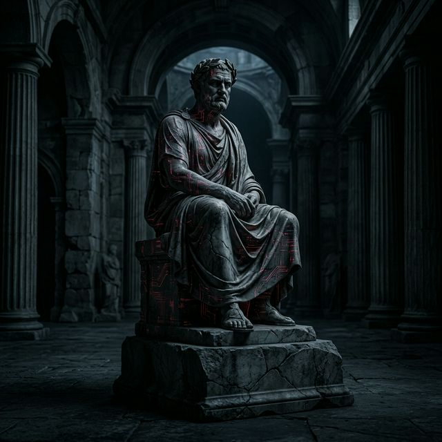
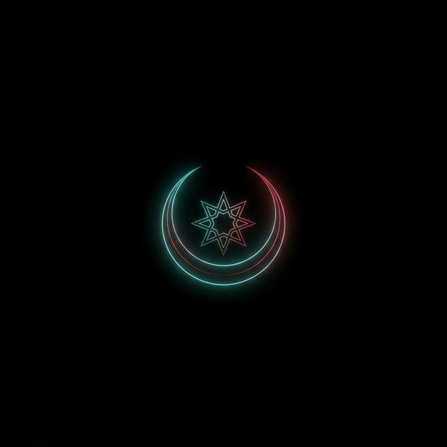
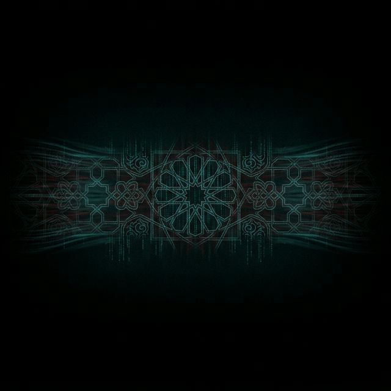
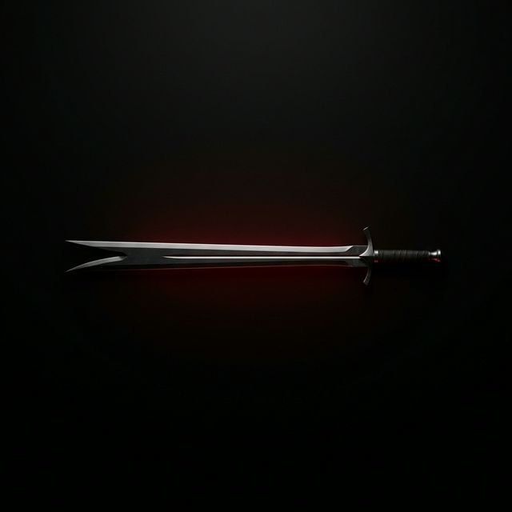

# 🌙 PROJE: KAYRA | Alperen Disiplini, Fütüvvet Protokolü ve Dijital Nizam

> **"Kuvvetli mümin, (Allah katında) zayıf müminden daha hayırlı ve daha sevimlidir."** (Müslim, Kader, 34)
> 
> **"Kendi nefsine galip gelemeyen, hiçbir düşmana galip gelemez."** (Hz. Ali r.a.)
>
> **"Hakiki imanı elde eden adam, kâinata meydan okuyabilir."** (Bediüzzaman Said Nursi)
>
> **"Suç, bu asırda masumiyetin yokluğu değil, hakikatin bir pazarlama aracına dönüşmesidir."** (Örtülü Gaflet)

KAYRA (Eski Türkçe'de lütuf, takdiri ilahi, İslami lügatte inayet); modern dünyanın materyalist tuzağına, hazcı illüzyonlara ve erkeği fıtratından (yaradılış kodlarından) koparan batıl akımlara karşı inşa edilmiş bir **Metafiziksel Savunma, İrade ve Diriliş Karargahıdır.** 

Bu depo; sıradan bir kişisel gelişim zırvası, klavye ardında yazılmış sahte bir "alfa erkek" kılavuzu veya Batı'nın kibir pompalayan seküler "kırmızı hap" (redpill) dogmasının ucuz bir kopyası değildir. Aksine, KAYRA seküler olanı tamamen reddeder. Unutulmuş şuurun fabrika ayarlarına (Sünnetullah'a) radikal bir geri dönüş operasyonudur. Alperen ruhunu, İslam fıkhını, tevekkülü, fütüvveti ve savaşçı-derviş (Gazi-Derviş) dengesini günümüz sibernetik ve psikolojik çatışmalarıyla harmanlayarak, dijital çağın uyuşturulmuş, manipüle edilmiş kitleleri arasından sıyrılacak keskin, bükülemez, sarsılamaz bir şahsiyet (Şahsiyet-i İslamiye) yaratma idealinin kodlanmış tecellisidir.

---

## 🌑 I. BÜYÜK UYANIŞ: ENE'NİN PUTLAŞMASI VE AHİR ZAMAN SİMÜLASYONU

İçinde bulunduğumuz asır, "insanın manasına" ve bilhassa "erkekliğe" karşı açılmış senkronize bir tasfiye savaşıdır. Sistem, kılıçlarla veya mermilerle değil; sosyal medya algoritmaları, sahte kariyer hırsları, bitmek bilmeyen tüketim arzuları ve hormonal saldırılarla (endüstriyel gıdalar) saldırır. Jean Baudrillard'ın deyimiyle bizler artık bir "Simülakrlar (Görüntüler) Evreninde" yaşıyoruz; hakikat yeryüzünden silindi, onun yerine onun sahte ve lezzetli dijital kopyaları konuldu. Biz bu matrikse 'Gaflet' diyoruz.

1. **'Ene' (Benlik) Putu ve Narsizm İflası:** Modern Batı kültürü sürekli olarak bilinçaltımıza *"Kendin ol, kalbinin sesini dinle, dünyadaki en eşsiz ve biricik varlık sensin"* mesajını pompalar. Bu, İslami metafizikte **'Ene' (Benlik / Ego)** kavramının şeytani bir şekilde şişirilmesinden başka bir şey değildir. Ene, aslında Yaratıcı'nın sıfatlarını kıyaslayarak (Vahid-i Kıyasi) kendi sınırlarını idrak etmen için sana verilmiş bir ölçü aracıdır. Ancak modern insan onu mutlaklaştırıp **Mana-i İsmiyle** (kendine ait ve kalıcı bir varlık atfederek) benimsemiş ve kendini adeta yeryüzünde küçük, ölümsüz bir İlah zannetmiştir. Bunun kaçınılmaz psikolojik ve sosyolojik sonucu: Narsist, kof, sürekli dışarıdan onay tapan, en ufak bir yoklukta, eleştiride veya kriz anında un ufak olan zavallı ve dayanıksız yığınların türemesidir.
2. **Kavvamlık Misyonunun İhlali ve Kaos:** Allah (c.c), Müslüman erkeğin inancına ve ailesine göğsini siper etmesini, yıkılmaz bir kalkan (Kavvam) olmasını kanun kılmıştır. Ancak Ene'si şişirilmiş, sanal vizyonlarla zehirlenmiş ve dijital konfora esir edilmiş günümüz erkeği, "kavvam"iyet yükünden kaçmış, sorumluluğu bırakıp kadınlarla bedensel ve ruhsal rekabete girerek kendi elleriyle pasifleşmiştir. Doğa (Fıtrat) vakum yani boşluk kabul etmez; erkeğin korkakça terk ettiği otorite ve liderlik alanını anında kaos, duygusal histeri ve sosyolojik dejenarasyon doldurur. Evini ve kalbini koruyamayan bir erkek, tüm medeniyeti pazar yerine çeviren zayıflığın suç ortağıdır.
3. **Gerçek Hakikat (Sırr-ı Nur ve İhlas):** Toplumun seküler medya aracılığıyla dayattığı "tepkisiz, salt empatik, risk almayan, modern sistemin uslu zararsız çocuğu" profili şeytani bir ehlileştirme kumpasıdır. Kayra doktrini, insanın bu derin gaflet rüyasından şok edici bir acıyla uyanarak kainattaki her zerreye **Mana-i Harfi** (Yaratıcı'nın sanatının yansıması) gözüyle bakabilmesidir. "Ben başardım, ben yaptım, benim aklımla oldu" kibrini postallarının altında ezip geçerek, gücünü mutlak bir teslimiyetten (İslam'dan) alan; küfre ve düşmanına karşı çelikten inen acımasız bir balyoz, mazluma ve dostuna karşı ise altında soluklanacak gölgesine sığınılacak devasa bir çınar olmaktır.

---

## ⚔️ II. ALPEREN ARKETİPİ: ACZ VE FAKR'DAN DOĞAN MUTLAK KUDRET

Türk-İslam sentezinin bin yıllık tarihinde varlığını sürdüren "Alperen" mefhumu, iki zıt gibi görünen ama aslında bir madalyonun vazgeçilmez iki yüzü olan kutbun kusursuz birleşimidir: **Alp (Savaşçı / Celal ekseni)** ve **Eren (Derviş / Cemal ekseni)**. Bu arketip sıradan bir denge değil, her ikisinin de zirvesini (Maksimum Celal ve Maksimum Cemal) aynı anda bünyede taşımaktır.

KAYRA erkeği, gücünü modern dünyanın yalan söylediği gibi yalnızca banka hesabından, pazu kalınlığından veya sahip olduğu dünyevi unvanlardan yola çıkarak tanımlamaz. O, asıl ölümsüz gücünü **Acz ve Fakr** makamından alır. Bir kul, asıl Yaratıcı'sının (El-Mütekebbir, El-Kaviyy) devasa kudreti karşısında ne kadar aciz (helpless) ve kendi özünde ne kadar fakir (needy) olduğunu iliklerine kadar idrak ederse, o vakit sırtını O'nun sonsuz ve bitmez kudretine dayamış olur. Sırtını Mutlak Güç'e dayayan bir kalp, yeryüzündeki hiçbir devletten, hiçbir patrondan, hiçbir seküler sistemden, hiçbir fakirlikten fütur etmez, korku kırıntısı taşımaz. *"Hakiki imanı elde eden adam kainata meydan okuyabilir"* sırrının siber çağdaki operasyonel tanımı tam olarak budur. 

*   Sadece rasyonel gücü elinde barındıran **Alp (Savaşçı)** olan, kalbindeki ilahi bağlantıyı koparırsa kibre kapılır, fıravunlaşır, elindeki orduyu veya ticari gücü zulme alet ederek merhameti (Cemal'i) unutur; bir zorbadan ibaret kalır.
*   Sadece ruhaniyata meyleden **Eren (Derviş)** olan ise, dünyevi donanımları (diplomasiyi, yazılımı, silahı, finansı) elinden bırakırsa pasifleşir, köşesine itilir, aksiyondan ve cihaddan kopar. Meydanı, medyayı ve akademiyi şeytani sistemlerin insafına bedavadan terk etmiş olur.
*   **Tamamlanmış Alperen Sentezi:** Gündüzleri şirketin ceosuna, sistemin küresel efendisine, ticaret masasının acımasız kanunlarına kafa tutan, strateji kuran, sistemi en içinden hackleyen tavizsiz bir rasyonalist; gecelik karanlık çöktüğünde ise teheccüd seccadesinde tek başına secdeye kapanıp tüm günün hesabını vererek kendi faniliği ve hataları için gözyaşı döküp titreyen bir tasavvuf ehlidir. Kayra bu ikiliğin tek potada eritilmesidir.

---

## 📜 III. KAYRA MANİFESTOSU: 7 ÇELİK YASA VE ONTOLOJİK DERİNLİK

Bu manifesto, sadece gençleri gaza getirmek için odaların duvarlarına asılacak süslü bir motivasyon metni değildir; bilakis kan, ter, acı, ihlas ve çelik bir irade ile idrak edilip uygulanması gereken; hilafına hareket edildiğinde acımasız sonuçlar doğuran fıtrat yasalarıdır.

### 1. Radikal Mesuliyet ve Cebriye'nin Reddi (Sistem-i İrade)
Başına gelen bütün badireler için "Türkiye ekonomisini, liyakatsiz politikacıları, vefasız cinsi latifi, ailenden miras kalan berbat genlerini veya küresel güçleri" suçlama kolaycılığını derhal bırak. Geçmişin suçunu başkasına atmak, kölelere özgü bir psikolojik rahatlama zehridir. İslam İtikadında *Cebriye* isimli sapkın ekol, "İnsan rüzgardaki yaprak gibidir, kaderin elinde mahkumdur" diyerek iradeyi reddeder. Oysa Ehl-i Sünnet'in ve Kayra felsefesinin temeli, sana emanet edilen "Cüz-i İrade"ye sahip çıkmaktır. Bedir cenginde İslam ordusu sadece 313 aç kalmış adamla, tepeden tırnağa teknoloji (silah) ve zırh kuşanmış 1000 kişilik elit ordunun karşısına çıkarken şikayet etmedi, mazeret üretmedi. Zorluk, fırsatın maske takmış halidir. Şartlar ölümcül derecede zorsa, o karanlığı paramparça edecek olan çelik iradeyi dışarıdan beklemeyecek, bizzat kendi tırnaklarınla kazıyarak göğsünden çıkaracaksın.

### 2. İstikamet, Çerçeve ve Sözün Namusu (Sırat-ı Müstakim)
Kur'an-ı Kerim, Fatiha suresinde bizden zenginlik, rahatlık, konfor veya uzun bir ömür istememizi öğretmez; günde 40 kere *"Bizi doğru yola (Sırat-ı Müstakim'e) ilet"* dememizi emreder. İstikamet, şuurunda her daim kılınçtan keskin o yolda yürümektir. Müslüman erkek hiçbir platformda, hiçbir menfaat dairesinde rüzgara göre eğilip bükülmez, dalkavukluk yapmaz; modern toplumdan "iyi çocuk" alkışı almak için kendi ana ilkelerinden (omurgasından) taviz vermez. İster milyarlık ticaretin entrikalarla dolu savaş alanında olsun, ister kadın-erkek ilişkilerinin (evlilik ve sadakat) en zor psikolojik test eşiklerinde; o fıtri "Çerçeveyi" (Frame) tavizsiz koruyan sen olacaksın. Stratejik kararlarını ilahi emre göre aldığında, gemileri Endülüs'ü fetheden Tarık bin Ziyad gibi tereddütsüz ateşe ver. Geri dönme ihtimalini masadan kaldıramayan adam, yarım zaferlere bile ulaşamaz. Yüksek statü, esnemekle değil, kuralları başkasına dayatmakla tesis edilir.

### 3. Tevekkül ve Rıza Makamı (Ateşi Gülistan Kılmak)
Antik Yunan stoacılığının sınırları belli "Amor Fati"sinin (Kaderini sevmenin) İslam teolojisindeki boyutu ölçülemez devasa karşılığı **Makam-ı Rıza'dır ("Ben ondan razıyım, O da benden")**. Hayatta ihanetlerle, iflas dalgalarıyla, ağır ve haksız iftiralarla yüzleştiğinde, duygusal histeriklere (Hezeyana) kapılıp köşeye çökmek bir Alperen'e tebliğ edilmiş en ağır haramdır. Rasyonel ve buz kütlesi gibi bir zihinle Zülfikarını çek, kılıcını savur, tüm diplomatik, donanımsal ve mantıksal hamleleri (deveni ağaca bağlama rasyonalitesini) mutlak suretle yap; ancak gecenin sonunda başını yastığa koyarken bütün neticeyi kalbinden kanatarak söküp at ve tebessümle Nemrut'un ateşine fırlatılan Halil İbrahim (a.s) gibi de: "Hasbunallah ve nîmel vekîl (O ne güzel vekildir)." Tevekkül tembellik değil, elinden geleni yaptıktan sonra sonuç konusundaki panik nöbetini Allah'ın güvencesi ardında yok etmektir.

### 4. Kavvamiyet ve Ebedi Fıtratın Muhafazası
Allah, *"Erkekler, kadınlar üzerine kavvamdır."* (Nisa: 34) hükmüyle, değişmez bir biyolojik, sosyolojik ve ilahi ontolojiyi ilan emiştir. Kadın ile erkeği aynı potada eriten, birbirine savaş açtıran, anneliği aşağılayıp kurumsal köleliği yücelten, haya perdesini sıyıran dejenere feminizme zerre kadar boyun eğme; onlar ilkel fıtratın muazzam tamamlayıcı (Yin-Yang) unsurlarıdır. Erkeğin misyonu; barikat kurmak, şiddet tekelini elinde tutup adaletle kullanmak, lojistik savaşını (rızkı) omuzlamak, sınırları aşılmaz şekilde çekmek ve geminin yegâne ve mutlak kaptanı (Lider/Patriarch) olmaktır. İtaati zayıflık, haya duygusunu (utanmayı) gericilik sanan modelleri kendi ekosisteminden silip at. Senin çemberine ancak liyakatli, asaletine (ahlakına) denk, sadık kalbine biat eden saliha bir hatun girebilir. Kıskançlığı (Gayret'i / Ghayrah mefhumunu) yitirmiş, ailesinin veya namusunun kâfirlerin gözlerine dijital ortamda meze yapılmasına göz yuman erkeğin imanı büyük bir tehlike sınırlarındadır; deyyusluk bu cennet dininin kapılarından sızamaz bile.

### 5. Helal Lojistik ve Zenginliğin Yüksek Fıkhı (Savaş Sandığı ve Ahilik Felsefesi)
Peygamber Efendimiz (s.a.v) *"Fakirlik neredeyse küfür olacaktı."* diyerek ekonomik çöküşün imanı dahi tehdit edeceğini asırlar öncesinden zihinlerimize çakmıştır. Sürekli miskinlik, parasızlık edebiyatı yaparak, kendi acizliğine uydurulmuş tembel bir tasavvuf sosu katarak küresel İslam davası güdülemez. Abdurrahman bin Avf'ın piyasayı regüle etmesi gibi, mazluma maddi kalkan olabilecek, siber ordular finanse edebilecek bir finansal kapasite (War Chest) üretmek senin lüksün değil farz-ı kifayendir. Osmanlı'daki **Ahilik (Fütüvvet) Teşkilatı'nın** asıl misyonu da aynen buydu: Toplumsal adaleti sağlamak, yüksek kalitede üretmek, küresel pazarın nabzını tutmak, ahiliği yaşatmak ama o mal tartılırken terazinin ayarında bir 'gram' eksiye (Haram) dahi yeltenmemek. Tasavvuf, lüks marka köleliğine girmek değil; trilyonlar kazansan bile o parayı 'cebinden' çıkarıp 'kalbine' asla sokmamaktır. Marka tapınımını (Riya/Gösteriş) ve kitleleri ezen tefeci kan emici düzenini (Riba/Faizi) sisteminden tamamen yalıt ve parayı sadece cihadın pilleri olarak kullan.

### 6. Tefekkür-ü Mevt (Matrix/Simülasyondan Mutlak Çıkış Hükmü)
Bugün sosyal medyanın "kaydır kaydır" bitmeyen dopamin algoritmalarında (doom scrolling) aklı eriyen, her gün saatlerini heba eden yığınlar adeta modern zamanın zombileridir. Hadis-i Şerif net ve keskindir: *"Ağızların tadını kaçıran ölümü çok zikredin."* Ölümü hep sağ omzunda taşıyan adam, yeryüzündeki hiçbir makamın kulu köpeği olmaz, kimseye alkış uğruna eğilmez. Sultan Alparslan'ı Büyük Selçuklu Hakanı yapan, parası değil; Malazgirt ovasına Roma'nın devasa orduları yaklaşırken *"Ölürsem bu giydiğim beyaz cübbem benim kefenim olsun"* diyerek çıkmasıydı. Ego şatosunu ve 'Ene' (Ben) putunu o nihai toprağın altına girmeden hemen bugün acımadan öldür (Ölmeden evvel ölünüz). Memento Mori'yi yaşa ki, hayatta kaybetmekten korktuğun o sahte kalelerin (statü, kariyer, sevilme arzusu) seni yönetmesine izin vermemiş olasın.

### 7. Uhuvvet ve Sırr-ı İhlas (İhvanın Sınanmış Çeliği)
Bediüzzaman Said Nursi Hazretleri'nin İhlas Risalesi'ndeki müthiş metafizik formülüyle: Üç tane bir boyutunda sıradan "Elif" (1-1-1) ayrı ayrı dursalar, çekişseler, birbirlerini hasetle izleseler kıymeti ve gücü sadece "üç"tür. Lakin onlar nefislerini yutarak aralarında "ihlas sırrıyla" bir araya gelseler (111) tam yüz on bir gücündedir! Gerçek ihlas ve çıkar gözetmeyen samimiyet, maddi 4 adamı manevi olarak 400 adamın yıkıcılığına ve kudretine ulaştırır. Düştüğünde seni tekmeleyecek toksik vampirleri, gaflete düşmüş dost bildiğin yılanları hayatından jiletle kazı. Yalnız kalmaktan (Halvet) çıldırmayacak, kafasının içindeki sessizlikle savaşabilecek o mutlak iradeyi bir kez inşa et. Ardından, arındırdığın bu saf çembere sadece senin inancını özetleyen, arkandayken sırtını kollayan, günah işlediğinde veya rotadan saptığında dalkavukluk yapmak yerine eksiğini yüzüne mertçe, hiddetle kusan o az sayıdaki sadık İhvan tayfasıyla doldur. Gerisi senin safkan zamanının çöpe atılmasından başka bir şey değildir.

---

## 📡 IV. SİBERNETİK TASAVVUF VE FREKANS SAVAŞLARI (DIGITAL MATRIX)

Modern çağın meydan muharebeleri siperlerin çamurunda değil; fiber optik kablolarda, ekranlarda, mikro çiplerde ve sürekli veri akışı sağlayan frekans algoritmalarında (Salgırımlarda) devam etmektedir. Uyanmazsan, zihnin ve sinir sistemin (Neural pathways) aralıksız olarak büyük teknoloji şirketleri ve medya kartelleri tarafından; sürekli korku iklimi yaratan zift karası haberlerle ve bedeni felç edici pornografik, şehevi tahriklerle 24 saat manipüle edilmektedir.

*   **Frekans Düşüklüğü (Gaflet Tuzağı):** Gürültülü içerikler, hiper-bağlantılı sosyal etkileşimler, dikkati saniyelere düşüren videolar (Tik-Tok vb.), sentetik/fast-food tabanlı hızlı yaşam formları seni iradi olarak "Nefs-i Emmare" (Kötülüğü emreden nefis) zemininde tutup hayvanlaştırmayı hedefler. Algoritmaların amacı senin sorgulayan, eyleme geçen, savaşan kavvam bir erkek olman değil; devamlı "tüketen, tıklayıp satın alan, yönlendirilebilir" tepkisiz dijital otlar olmandır.
*   **Dijital Asabiyet (Kayra Zırhı):** İbn Haldun tarihin akışını açıklarken o omuz omuza savaşılan "Asabiyet" şuurundan (Gönüllü ve fıtri kenetlenmişlik) bahseden büyük bir İslam sosyoloğudur. Bizler bugün KAYRA bünyesinde; dağınık, umutsuz ve konformist modern insanlara karşı **Siber-Asabiyet** kuruyoruz. Kan bağını aşan, pür ideolojiyle ve dijital zırhlanmayla kenetlenmiş adanmış bir yapı... Gaflet ordularına, ahlaksızlık tsunamisine karşı ilmi kodlamayı rasyonel kullanarak; dijital tasavvufu (gözün ve kulağın internet perhizini) tesis ediyoruz.

İşte tam da bu yüzden KAYRA deposunda göreceğiniz **ZIG Diliyle Yazılı Modüller (`kayra_engine`, `crypto_shield`, `futuwwa_neural`)** reponun süsü olarak oraya konmuş boş betikler değildir. Bunlar; 'Zihnin Kriptolojik Kalkanını' (Crypto Shield) matematiksel boyutta simüle eden, matrixin sızdırdığı virüslere (şeytani vesveselere) asla ama asla geçit vermeyen mutlak denetimli dijital kapılardır. Bünyesinde hafıza aracıları (Garbage Collector ve Runtime Engine overheadleri) barındırmayan saf ZIG dili gibi, "Kayra" da senin Rabbin ile arandaki engelleri ve senin hedefinle icraatın arasına girecek şikayetleri din adamları oligarşisini, psikoterapi bahanelerini yıkıp çöpe atarak iradeyi mutlak merkeze konumlandırır.

---

## 👨‍💻 V. DIGITAL MIMARI: ZIG ÇEKİRDEĞİ VE KAYRA.OS

### A) KAYRA.OS WEB DASHBOARD (Operasyonel Arayüz Karargahı)
Repo ana dizininde bulunan dijital mabediniz olan `index.html` senin günlük Karargah Kontrol Merkezin (GUI Frontend) olarak görevlendirildi. İrade Teorisi, her gün icraata dökülmediği sürece beyin fırtınalığı bir tatminden öteye geçemez.
*   **İrade Algoritması (Fıtrat Kodları):** Gaflet uykusunuz param parça eden **'Teheccüd Dirilişi'**, bedeni zayıf bırakan rahatlığını kanata kanata ezen **'Ağırlık İdmanı'**, modern köleliğin dopamin sarmalını hackleyen **'Dopamin (Haz) Orucu'** ve zihni silahlandıran **'İlim / Tefekkür'** rutinleri her gün bu ekranda. Bunları onayladıkça, aslında nöronlarındaki bağları güçlendirir, kendini yeniden programlarsın. Ekran, uyanmış adama layık şekilde Zifiri Siyah (Dark Mode), Selçuklu Firuzesi ve Alperen kırmızısı (Glassmorphism katmanlar) ile sarmalanmıştır.
*   **Ahi Sandığı (Dev War Chest):** Kapital yoksunluğa ve köpekleşmeye karşı başlatılan, kişisel hazinende biriktirdiğin kapital operasyon hedeflerini (Financial Goals) yüzdesel ve devasa progress bar ile anında takip ettiğin bir askeri bütçe arayüzü...

### B) KAYRA LOW-LEVEL ENGINE (ZIG SİBER KERNEL)
KAYRA kod tabanı; memory alanını milisaniyesine kadar takip eden, fıtrat gibi affı olmayan **ZIG** sistemi ile yazıldı ve siber estetiğin zirvesine taşıdı.
*   `kayra_engine.zig`: Nefsi Mülhime'ye geçişlerindeki o keskin cut-off'ları low level (düşük seviye) donanım olarak işleyen canavar yapı.
*   `crypto_shield.zig`: Matrix simülasyonundan gelen veri trafiğini kriptolojik olarak şifreleyen, nefs müdafaası yapan dijital güvenlik duvarı.

---

## ⏱️ VI. 24-SAAT MUTLAK NİZAM RUTİNİ (GÜNDELİK SAVAŞ PLANI)

Bütün felsefesi oturduktan sonra adamın yeryüzündeki gölgesi eylem çizgisidir. Aşağıdaki saat aralıkları esnetilemez demirbaş yasalardır.

*   **04:00 - 05:30 | İLAHİ NÖBET VE ACZİYET (Teheccüd/Sabah Safhası):** Rehavetin, sıcak yatağın ve gafletin zirve yaptığı o karanlık kuyu saatleri. Füze gibi o yorganı üstünden savur. Vücudun konfor isterken sen ruhuna itaat et. O ıssızlıkta Halık’a (Yaratıcıya) avuç aç. Bütün kibir pelerinini sırtından çıkar. *"Kuvvet ve Kudret Ancak O'nundur"* (Fakr Makamı) diyen adam, gün başladığında hiçbir varlığa köle olmaz.
*   **05:30 - 07:30 | İLMİ KILIÇLANMA (Aydınlanma Derinliği):** İbni Haldun okumaları, İmam Gazali tahlili, modern kodlama dökümantasyonu, piyasa analizleri, yabancı literatür… Piyasada seninle rekabet edecek milyarlarca insan hala horlayarak uyurken sen beynine (RAM’e) dünyaları yükle, bilgiyi analiz et, kendini yeni bir sürüme güncelle.
*   **08:00 - 18:00 | RIZIK CEPHESİ VE NİZAM (Kavvamlık / Cihat Lojistiği):** Maişet savaşı ebedi savaşın yakıtıdır (helal kazanç). Patronunla, piyasayla, müşterilerle karşılaştığında işinde peygamberler kadar El-Emin, savaşçılar kadar yetkin olacaksın (İhsan Makamı). Mazeret çöplüğünden çık, sistemi oyna, fırsatı sömür, terin kanatsın ve rızkı tabandan sökerek kendi "Savaş Sandığı" (War Chest) kasana istifle.
*   **18:30 - 20:00 | DEMİRİN HAKKI VE KAN (Kinetik İnşa):** Bedeni test edilmeyen zihnin sözleri edebiyattır. Konforunu halterlerin, demir kütlelerin, kum torbalarının ağırlıkları altında inleyerek acıyla lime lime et. İçinde yanan o sessiz travmaları, o bitmeyen erkeklik hiddetini demire göm.
*   **20:00 - 22:00 | CEMAL VAKTİ (Sırr-ı İhlas, Aile, Emanet):** Varlığını tamamen Cemal esmasına çevir. Eşine, ehline dağ gibi bir gölge at, kalkanla koru (Kavvam). İhvanınla ocağın başında o tasavvufi sadakat sohbetlerini (Sırr-ı İhlas) koyulaştır. Tüm ekranlardan sıyrıl; dijital zehirlenmenin dışına çık. Aileni ve kabileni zehirli kültürden izole et.
*   **22:30 | MEMENTO MORİ (Mutlak Teslimiyet ve Uyku):** Günü kapat. Her türlü Mavi/Led radyatif ışığı sök at. Gece karanlık ister; ruh o karanlıkta arınır. Yatağına, kefene giren bir Mevta (cenaze) gibi gir; çünkü uyku ölümün ikiz kardeşidir. Yaptığın isyanları hesaba çek (Muhasebe), ruhunu 'Kabz' (Can alan) ismine terk et, yarına Sünnetullah üzere uyanmaya ahdet.

---

## ✒️ VII. MÜHÜRLÜ YEMİN (THE SEALED OATH)

Bu doktrini satır satır idrak ettiysen, zayıflık ve mazeret üretme lüksün toprağa gömülmüştür. İçindeki o bağımlı, pısırık, bahaneci ve kibirli eski versiyonun infazı sağlandı, şimdi boğazlandı. 

> *“Ben, Allah’ın yeryüzündeki asil emanetçisi ve halifeliğine aday olan adam.*
> *Gaflet perdesini bir hançer gibi yırttım, uyandım.*
> *Artık mağdur edebiyatı yapmayacak, mazeret kusmayacak, sistemin zincirlerini yalayıp acıdan kaçmayacağım.*
> *Yalnızlık ve kriz anlarında Rabbimden başka sığınak aramayacağım.*
> *İrademi Sünnetullah’ın yörüngesinde, Zülfikar gibi çift yüzüyle keskin ve acımasız tutacağım.*
> *Kavgama fıtratımı dahil etmeden, celladıma gülümsemeden kılıcımı asla kınından sıyırmayacağım.*
> *Hasbunallah ve nîmel vekîl.”*

Ahdin sembolleşti. Karargah protokollerini bekler. Uyan, zinciri kır ve dünyayı ateşe ver!

---

## 🛰️ VIII. SİBER-ASABİYET VE DİJİTAL SİPERLER: ALGORİTMALARA KARŞI CİHAD

*“Zihinleri köleleştirmek, bedenleri köleleştirmekten daha derin bir zulümdür.”*

Modern dünya, mermilerin yerine verilerin (data) geçtiği sessiz bir savaş alanıdır. Bir Alperen, dijital dünyayı sadece bir eğlence aracı değil, fethedilmesi gereken bir "Siber-Darülislam" olarak görür.

1. **Algoritmik Prangalar:** Sosyal medya algoritmaları, seni "Nefs-i Emmare" seviyesinde tutmak için tasarlanmıştır. Her "kaydırma" (scroll), iradenden çalınan bir parçadır. KAYRA doktrini, algoritmaların kölesi değil, kodun efendisi olmayı emreder.
2. **Siber-Asabiyet (Digital Tribe):** Coğrafi sınırların ötesinde, aynı iradeye ve inanca sahip olanların kurduğu kopmaz bağdır. Bu bağ, kriptografik bir sadakatle (İhlas) örülür. Bizler, Matrix'in içinde ama Matrix'ten bağımsız bir **Siber-Vakıf** ekosistemi kuruyoruz.
3. **Zihin Kalkanı (The Shield):** Her bildirim (notification) bir saldırıdır. Her spekülatif haber bir sızmadır. Zihnini bir karargah gibi koru. Gereksiz veriyi jiletle ele, sadece stratejik bilgiyi (İlim) içeri al.

---

## 🌍 IX. KÜRESEL NİZAM VE ALPEREN STRATEJİSİ: İ'LÂ-YI KELİMETULLAH

*“Dünya bir handır, biz yolcuyuz. Menzil ise rızayı ilahidir.”*

KAYRA sadece bireysel bir gelişim sistemi değildir; o, küresel bir nizam (Order) tasavvurudur. 

*   **Ekonomik Hegemonya:** Faiz (Riba) düzeni üzerinden dünyayı köleleştiren sisteme karşı; helal ticaret, Ahi disiplini ve yüksek teknoloji üretimiyle cevap verilir. Güçlü bir ekonomi, cihadın lojistik şah damarıdır.
*   **Kültürel İstila ve Karşı-Hamle:** Batı'dan gelen ve fıtratı bozan (LGBT, radikal narsisizm, sekülerizm) her türlü akıma karşı; İslami estetiğin, vakarın ve heybetin siber dünyada yeniden inşası şarttır.
*   **Stratejik Sabır (Sabr-ı Cemil):** Alperen, aceleci değildir. O, asırlık planların parçasıdır. Kaderin rüzgarını arkasına alan bir stratejist, en karanlık gecede bile şafağın tohumlarını eker.

---

## ⚙️ X. TEKNİK MİMARİ: ZİG MOTORU VE SİBER-ASABİYET KODU

KAYRA'nın kalbinde yatan Zig tabanlı motor, modern dillerin (Java, Python gibi) hantallığını ve "garbage collector" (hafıza temizleyici) bağımlılığını reddeder.

*   **Safe-Manual Memory:** Tıpkı bir Alperen'in kendi nefsini sürekli denetlemesi gibi, Zig de hafızayı manuel ama güvenli bir şekilde yönetir. Hata kabul etmez, mazeret dinlemez.
*   **`crypto_shield.zig`**: Entropi tabanlı zihin kalkanı simülasyonu.
*   **`futuwwa_neural.zig`**: Alp (Celal) ve Eren (Cemal) ağırlıklı karar mekanizması. Bu motor, gelen her veriyi (threat) İslami vakar filtresinden geçirerek çıktı üretir.

---

## 📖 XI. ALPEREN TERİMLER SÖZLÜĞÜ (GLOSSARY)

*   **Kavvam:** Erkeğin koruyucu, düzenleyici ve yönetici asli fıtratı.
*   **İhvan:** Dünya menfaati gütmeyen, sırtını dayayabileceğin dava kardeşi.
*   **Fütüvvet:** Mertlik, yiğitlik ve başkası için yaşama sanatı.
*   **Mana-i Harfi:** Her şeye Allah'ın sanatı gözüyle bakmak.
*   **Mana-i İsmi:** Şeylerin kendinden var olduğunu sanmak (Gaflet).
*   **Celal:** Allah'ın heybet, azamet ve hiddet tecellisi (Alp yüzü).
*   **Cemal:** Allah'ın lütuf, merhamet ve güzellik tecellisi (Eren yüzü).
*   **Ahi Sandığı:** Gelecekteki operasyonlar için biriktirilen helal savaş rezervi.

---

## 🏔️ XII. ALPEREN GELİŞİM KATMANLARI: TALİPTEN NAKİBE

KAYRA hiyerarşisi, dünyevi bir rütbe değil, sorumluluk ve liyakat dairesidir.

1.  **Talip (Aday):** Henüz gaflet uykusundan uyanmış, 24 saatlik nizamı oturtmaya çalışan, nefsini terbiye etmeye azmetmiş kişi.
2.  **İhvan (Kardeş):** Nizama sadık kalmış, belirli bir teknik veya ilmi yetkinliğe ulaşmış, güvenliği sınanmış sadık üye.
3.  **Hadim (Hizmetli):** Kendi gelişimini aşmış, İhvan'ın ve mazlumların ihtiyaçları için koşan, lojistik ve teknik gücü yöneten operasyonel güç.
4.  **Nakip (Öncü):** Strateji kuran, İhvanı sevk ve idare eden, Arş-ı İrade seviyesine ulaşmış lider.

## 🕴️ XIII. OPERASYONEL GÜVENLİK (OPSEC) VE SİBER-SADAKAT

*“Dostuna sırrını söyleme, dostunun da dostu vardır.”*

Alperen, modern gözetim toplumunda bir "hayalet" (Panopticon'un dışındaki göz) olmayı öğrenmelidir.

*   **Veri Minimizasyonu:** Gereksiz hiçbir kişisel veriyi dijital kalıntılarda bırakma. 
*   **Anonimlik ve Vakar:** İsminin değil, icraatının konuşulmasını sağla. Mümkün olduğunca kapalı devre iletişim sistemlerini kullan.
*   **İnfak Bilgisi:** Yaptığın finansal cihadın (sadaka ve yatırımların) miktarını ve hedefini ihvan hiyerarşisi dışında kimseyle paylaşma.

## 🧮 XIV. TEKNİK DERİNLİK: ASABIYAH_NET VE DAĞITIK SİSTEMLER

KAYRA v2.0 ile gelen `asabiyyah_net.zig` modülü, sadece bir simülasyon değil, dağıtık bir güven ağının (Trust Network) temelidir.

*   **Ağırlıklı Güven Algoritması:** Her ihvan düğümü, liyakatine ve sadakatine göre bir "Trust Weight" (Güven Ağırlığı) taşır. Ağın toplam gücü, bu düğümlerin birbirine olan ihlaslı kenetlenmişliği ile belirlenir.
*   **Fail-Safe Mechanism:** Bir düğüm "vesvese" veya "ihanet" (Malicious activity) nedeniyle bozulursa, sistem o düğümü anında yalıtır (Isolation) ve ağın bütünlüğünü korur.

## ❓ XV. ALPEREN FAQ (SIKÇA SORULAN SORULAR)

*   **S: Bu sistem çok sert değil mi?**
    *   C: Dünya yumuşak bir yer değil. Çelik, ancak ateşin ve çekicin şiddetiyle dövülür.
*   **S: Sadece kod bilmek yeterli mi?**
    *   C: Hayır. Kodsuz bir Alperen silahsız bir asker; imansız bir kodcu ise ruhsuz bir makinedir. Her ikisi de gereklidir.
*   **S: Bu bir tarikat mı?**
    *   C: Hayır. Bu bir **Aksiyon ve İrade Karargahıdır.** Şahıs odaklı değil, ilke ve fıtrat odaklıdır.

---

## 🎨 XVI. ALPEREN SEMBOLİZMİ VE ESTETİĞİ (THE AESTHETIC OF IRADE)

KAYRA Karargahı'nın her rengi ve çizgisi, ontolojik bir hakikate işaret eder.

*   **Zifiri Siyah (Aşk-ı Muhabbet):** Gecenin ve teheccüdün rengidir; nefsin öldürüldüğü, benliğin (Ene) yok olduğu mutlak tevazuyu simgeler.
*   **Alperen Kırmızısı (Celal):** Gazanın, hiddetin, şehadetin ve matrixin algoritmalarını parçalayan o sarsılmaz Alp ruhunun tecellisidir.
*   **Selçuklu Turkuazı (Cemal):** İlmin, ferahlığın, imanın derinliğinin ve kardeşlik bağlarının (Uhuvvet) serinliğidir.
*   **Altın Sarısı (Şahsiyet):** Hakikatin pahasını, sarsılmaz değerleri ve 'Ahi Sandığı'nın lojistik ağırlığını temsil eder.

## 🏹 XVII. NİZAM-I ÂLEM VE SİBER-FETİH: GELECEK VİZYONU

*“Sözümüz odur ki; biz gelmedik dava için, biz geldik sevda için.”*

KAYRA, sadece korunmak için değil, fethetmek için vardır.

*   **Dijital Darü’l-Fünun:** Kendi eğitim platformlarımızı, kendi üniversitemizi ve kendi bilgi üretim merkezlerimizi (Arş-ı İrade) dijitalde inşa etmek.
*   **Küresel Asabiyet Ağı:** Tüm dünyadaki Alperenleri kriptografik olarak birbirine bağlayan, merkezi olmayan (Decentralized) bir 'Ümmet-i Muhammed' siber-ekosistemi.
*   **Fıtratın Restorasyonu:** Bozulmuş tüm kavramları (erkeklik, aile, sadakat, emek) aslına döndürecek dijital karşı-kültür devrimi.

## ⛓️ XVIII. TEKNİK SİLSİLE: VERSİYON GEÇMİŞİ VE MİRAS

Proje, tek bir kod satırından bir medeniyet tasavvuruna evrilmiştir.

*   **v1.0 - Uyanış:** Temel Zig çekirdeği ve ilk manifesto.
*   **v2.0 - Arş-ı İrade:** Siber-Asabiyet tablosu, 5. Protokol (Zunji) ve Premium Glassmorphism UI.
*   **v3.0 - Arş-ı Nizam (Ultimate):** build.zig entegrasyonu, Operational Log terminali, Senaryo testleri ve 'Kripto-Tasavvuf' derinliği.

## ✊ XIX. NİHAİ ÇAĞRI: BOĞAZLANAN ERKEKLİĞİN VE İMANIN DİRİLİŞİ

Ey Talip! Bu depo önünde bir mazeret değil, bir davetiyedir. 
Eğer bu satırları okuyorsan, matrixten sızan ışığı gördün demektir. 
Ya gaflet uykusuna geri dönüp saniyelerle harcanan bir "tüketici" olarak öleceksin; ya da bu sancağı (KAYRA) kuşanıp kendi hayatının, kabilenin ve geleceğin **Kavvamı** olacaksın.

**Yalnız değilsin. İhvan seni bekliyor. Karargah hazır. Kodunu yaz, iradeni kuşan, tarihini kendin çiz!**

---

> [!NOTE]
> Bu manifesto, statik bir metin değildir. O, yaşayan, kodlanan ve her gün seccadede ve sahada kanatılan bir iradenin dijital tecellisidir. 
> **KAYRA protokollerine sadık kal. Karargah seni bekliyor.**

